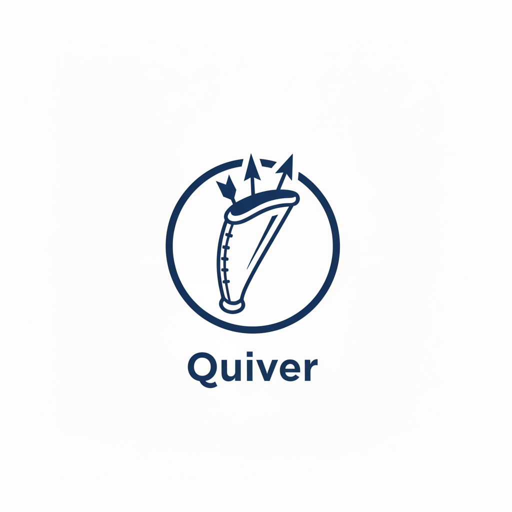

<p align="center">
  
</p>

# Quiver

A pure Swift implementation of **QUIC** (RFC 9000), **HTTP/3** (RFC 9114), **QPACK** (RFC 9204), and **WebTransport** — built with modern Swift concurrency.

> [!NOTE]
> **This project is AI-generated and human-validated.** The code was produced with the assistance of AI tooling (Claude) and reviewed, tested, and validated by [Nassim Zen (@hironichu)](https://github.com/hironichu).

## Overview

Quiver provides a complete, type-safe QUIC stack designed for modern Swift applications. From low-level packet processing to high-level HTTP/3 servers and WebTransport sessions, every layer is built with `async/await`, `Sendable` types, and structured concurrency.

### Highlights

- **Full QUIC transport** — RFC 9000/9001/9002 compliant with TLS 1.3, 0-RTT, connection migration, and congestion control
- **HTTP/3 server & client** — RFC 9114 with routing, request/response API, and QPACK header compression
- **WebTransport** — Bidirectional/unidirectional streams and datagrams over HTTP/3, compatible with browsers (Chrome) and Deno
- **Pure Swift** — No C dependencies for protocol logic; uses Apple's swift-crypto ecosystem

## Features

| Layer | Capabilities |
|-------|-------------|
| **QUIC Transport** | Long/Short headers, all 19 frame types, coalesced packets, version negotiation, retry, stateless reset |
| **TLS 1.3** | Full handshake state machine, X.509 validation (EKU/SAN/NameConstraints), 0-RTT early data, session resumption, key update |
| **Streams** | Bidirectional & unidirectional, flow control, priority scheduling (RFC 9218), out-of-order reassembly |
| **Recovery** | RTT estimation, loss detection (packet/time threshold), NewReno congestion control, pacing, ECN, anti-amplification |
| **HTTP/3** | Frame codec, SETTINGS negotiation, request routing, streaming responses, Extended CONNECT |
| **QPACK** | Static table, literal encoding, Huffman codec (RFC 9204) |
| **WebTransport** | Session management, bidi/uni streams, datagrams, capsule protocol, browser & Deno compatibility |
| **Security** | Integer overflow protection, ACK range validation, bounded iteration, graceful shutdown, continuation leak prevention |

## Requirements

- Swift 6.0+
- macOS 15.0+ / Linux (Ubuntu 22.04+)

## Installation

Add Quiver to your `Package.swift`:

```swift
dependencies: [
    .package(url: "https://github.com/hironichu/quiver.git", branch: "main")
]
```

Then add the products you need:

```swift
.target(
    name: "MyApp",
    dependencies: [
        .product(name: "QUIC", package: "Quiver"),     // Full QUIC stack
        .product(name: "HTTP3", package: "Quiver"),     // HTTP/3 + WebTransport
        .product(name: "QPACK", package: "Quiver"),     // Header compression
        .product(name: "QUICCore", package: "Quiver"),  // Core types only
    ]
)
```

### Dependencies

- [swift-crypto](https://github.com/apple/swift-crypto) — Cryptographic operations
- [swift-certificates](https://github.com/apple/swift-certificates) — X.509 certificate handling
- [swift-asn1](https://github.com/apple/swift-asn1) — ASN.1 encoding/decoding
- [swift-log](https://github.com/apple/swift-log) — Structured logging
- [swift-nio-udp](https://github.com/hironichu/swift-nio-udp) — UDP transport

## Architecture

```
┌─────────────────────────────────────────────────────────────┐
│  WebTransport (Sessions, Streams, Datagrams)                │
├─────────────────────────────────────────────────────────────┤
│  HTTP/3 (Server, Client, Router, Extended CONNECT)          │
├─────────────────────────────────────────────────────────────┤
│  QPACK (Header Compression, Static Table, Huffman)          │
├─────────────────────────────────────────────────────────────┤
│  QUIC Endpoint (Server/Client Entry Point)                  │
├─────────────────────────────────────────────────────────────┤
│  ManagedConnection (High-Level Connection API)              │
├─────────────────────────────────────────────────────────────┤
│  ConnectionRouter (DCID-based Packet Routing)               │
├─────────────────────────────────────────────────────────────┤
│  QUICConnectionHandler (Connection State Machine)           │
├─────────────────────────────────────────────────────────────┤
│  Stream Management (Multiplexing, Flow Control, Priority)   │
├─────────────────────────────────────────────────────────────┤
│  Recovery (Loss Detection, Congestion Control, Pacing)      │
├─────────────────────────────────────────────────────────────┤
│  Packet Codec (Encoding/Decoding, Header Protection)        │
├─────────────────────────────────────────────────────────────┤
│  Frame Codec (All 19 QUIC Frame Types + HTTP/3 Frames)      │
├─────────────────────────────────────────────────────────────┤
│  Crypto (TLS 1.3, AEAD, Key Derivation, X.509)             │
├─────────────────────────────────────────────────────────────┤
│  Core Types (Varint, ConnectionID, Version, Headers)        │
├─────────────────────────────────────────────────────────────┤
│  UDP Transport (swift-nio-udp)                              │
└─────────────────────────────────────────────────────────────┘
```

## Module Structure

```
quiver/
├── Sources/
│   ├── QUIC/                    # High-level public API
│   │   ├── QUICEndpoint.swift         # Server/client endpoint
│   │   ├── ManagedConnection.swift    # Connection with async streams
│   │   ├── ManagedStream.swift        # Stream wrapper
│   │   ├── ConnectionRouter.swift     # DCID-based routing
│   │   ├── PacketProcessor.swift      # Encryption/decryption
│   │   └── QUICConfiguration.swift    # Configuration options
│   │
│   ├── QUICCore/                # Core types (no I/O)
│   │   ├── Packet/                    # Headers, ConnectionID, Version
│   │   ├── Frame/                     # All 19 frame types + codec
│   │   └── Varint.swift               # Variable-length integers
│   │
│   ├── QUICCrypto/              # TLS 1.3 & cryptography
│   │   ├── TLS/                       # Handshake state machine
│   │   │   ├── TLS13Handler.swift     # Full TLS 1.3 implementation
│   │   │   └── X509/                  # Certificate validation
│   │   ├── AEAD.swift                 # AES-GCM, ChaCha20-Poly1305
│   │   ├── HeaderProtection.swift     # Packet header protection
│   │   └── KeySchedule.swift          # HKDF key derivation
│   │
│   ├── QUICConnection/          # Connection management
│   │   ├── ConnectionState.swift      # State machine
│   │   ├── QUICConnectionHandler.swift
│   │   └── PathValidationManager.swift
│   │
│   ├── QUICStream/              # Stream management
│   │   ├── DataStream.swift           # Send/receive state machines
│   │   ├── StreamManager.swift        # Multiplexing & lifecycle
│   │   ├── FlowController.swift       # Flow control
│   │   └── DataBuffer.swift           # Out-of-order reassembly
│   │
│   ├── QUICRecovery/            # Loss detection & congestion
│   │   ├── LossDetector.swift         # Packet loss detection
│   │   ├── AckManager.swift           # ACK generation & tracking
│   │   ├── RTTEstimator.swift         # RTT measurement
│   │   └── NewRenoCongestionController.swift
│   │
│   ├── QUICTransport/           # UDP integration
│   │
│   ├── QPACK/                   # Header compression (RFC 9204)
│   │   ├── QPACKEncoder.swift
│   │   ├── QPACKDecoder.swift
│   │   ├── StaticTable.swift
│   │   └── HuffmanCodec.swift
│   │
│   └── HTTP3/                   # HTTP/3 (RFC 9114)
│       ├── HTTP3Server.swift          # Server with routing
│       ├── HTTP3Client.swift          # Connection-pooling client
│       ├── HTTP3Connection.swift      # HTTP/3 connection manager
│       ├── HTTP3Settings.swift        # SETTINGS negotiation
│       ├── Frame/                     # HTTP/3 frame codec
│       ├── Stream/                    # HTTP/3 stream types
│       └── WebTransport/             # WebTransport support
│           ├── WebTransport.swift             # Client entry point (connect API)
│           ├── WebTransportOptions.swift       # Simple client options
│           ├── WebTransportOptionsAdvanced.swift # Power-user client options
│           ├── WebTransportServer.swift        # Server actor (middleware + routing)
│           ├── WebTransportServerOptions.swift # Server configuration
│           ├── WebTransportReply.swift         # Middleware reply + request context
│           ├── WebTransportSession.swift       # Session lifecycle
│           ├── WebTransportStream.swift        # Stream wrapper
│           ├── WebTransportCapsule.swift       # Capsule codec
│           └── WebTransportError.swift         # Error types
│
├── Examples/
│   ├── QUICEchoServer/          # QUIC echo demo
│   ├── HTTP3Demo/               # HTTP/3 server & client
│   └── WebTransportDemo/        # WebTransport echo (bidi/uni/datagram)
│
└── Tests/
    ├── QUICCoreTests/
    ├── QUICCryptoTests/
    ├── QUICRecoveryTests/
    ├── QUICStreamTests/
    ├── QUICTests/
    ├── QPACKTests/
    ├── HTTP3Tests/
    └── QUICBenchmarks/
```

## Usage

### QUIC Server & Client

```swift
import QUIC

// Server: Accept incoming connections
let server = QUICEndpoint(role: .server)
try await server.start(address: SocketAddress(ipAddress: "0.0.0.0", port: 4433))

for try await connection in server.incomingConnections {
    Task {
        for try await stream in connection.incomingStreams {
            let data = try await stream.read()
            try await stream.write(data) // Echo back
            try await stream.closeWrite()
        }
    }
}

// Client: Connect and send data
let client = QUICEndpoint(role: .client)
let connection = try await client.connect(
    to: SocketAddress(ipAddress: "127.0.0.1", port: 4433)
)
let stream = try await connection.openStream()
try await stream.write(requestData)
try await stream.closeWrite()
let response = try await stream.read()
await connection.shutdown()
```

### HTTP/3 Server

```swift
import HTTP3

let server = HTTP3Server()

// Register routes
server.route("GET", "/") { request, context in
    return HTTP3Response(status: 200, body: Data("Hello, HTTP/3!".utf8))
}

server.route("GET", "/json") { request, context in
    let json = Data(#"{"message": "quiver"}"#.utf8)
    return HTTP3Response(
        status: 200,
        headers: [("content-type", "application/json")],
        body: json
    )
}

try await server.listen(host: "0.0.0.0", port: 4433)
```

### HTTP/3 Client

```swift
import HTTP3

let client = HTTP3Client()
let response = try await client.get("https://localhost:4433/json")
print("Status: \(response.status)")
print("Body: \(String(data: response.body, encoding: .utf8)!)")
```

### WebTransport Server

```swift
import HTTP3
import QUIC

let serverOpts = WebTransportServerOptions(
    certificateChain: [certData],
    privateKey: keyData,
    maxSessions: 4
)

let server = WebTransportServer(
    host: "0.0.0.0",
    port: 4433,
    options: serverOpts,
    middleware: { context in
        // Optional: inspect context.path, context.headers, context.origin
        return .accept
    }
)

// Register paths (unmatched paths get 404 when routes are registered)
await server.register(path: "/echo")

// Start via external QUIC endpoint (recommended for full TLS control)
// or call server.listen() for simple cases
await server.serve(connectionSource: quicEndpoint.newConnections)

for await session in await server.incomingSessions {
    Task {
        for await stream in await session.incomingBidirectionalStreams {
            let data = try await stream.read()
            try await stream.write(data) // Echo
        }
    }
    Task {
        for await datagram in await session.incomingDatagrams {
            try await session.sendDatagram(datagram)
        }
    }
}
```

### WebTransport Client

```swift
import HTTP3
import QUIC

// Simple — insecure defaults for dev/testing
let session = try await WebTransport.connect(
    url: "https://example.com:4433/echo",
    options: .insecure()
)

// Or advanced — full QUIC config control
let session = try await WebTransport.connect(
    url: "https://example.com:4433/echo",
    options: WebTransportOptionsAdvanced(quic: myQuicConfig)
)

// Open a bidirectional stream
let stream = try await session.openBidirectionalStream()
try await stream.write(Data("Hello, WebTransport!".utf8))
let response = try await stream.read()

// Send a datagram
try await session.sendDatagram(Data("ping".utf8))
```

### Frame Encoding/Decoding

```swift
import QUICCore

let codec = StandardFrameCodec()

// Encode
let frames: [Frame] = [
    .ping,
    .ack(AckFrame(
        largestAcknowledged: 100,
        ackDelay: 10,
        ackRanges: [AckRange(gap: 0, rangeLength: 5)]
    )),
    .stream(StreamFrame(streamID: 4, offset: 0, data: payload, fin: false))
]
let encoded = try codec.encodeFrames(frames)

// Decode
let decoded = try codec.decodeFrames(from: encoded)
```

## Performance

Benchmarks measured on Apple Silicon (arm64-apple-macosx):

| Category | Operation | Throughput |
|----------|-----------|-----------|
| **Packet** | Short header parsing | 4.7M ops/sec |
| **Packet** | Long header parsing | 1.4M ops/sec |
| **Packet** | DCID extraction | 6.5–21.2M ops/sec |
| **Core** | Varint encode/decode | 3.4–12.5M ops/sec |
| **Core** | ConnectionID equality | 42.3M ops/sec |
| **Frame** | PING encode/decode | 22–24M ops/sec |
| **Frame** | STREAM frame encoding | 2.1M ops/sec |
| **Crypto** | Initial key derivation | 23K ops/sec |
| **Recovery** | Loss detection | 26K ops/sec |
| **Recovery** | Full ACK cycle | 1.9M pkts/sec |
| **Recovery** | Multi-range ACK (25) | 4.8K ops/sec |

```bash
swift test --filter QUICBenchmarks
```

## Testing

383+ tests covering all layers:

```bash
# Run all tests
swift test

# Run specific suites
swift test --filter QUICCoreTests      # Core types & codecs
swift test --filter QUICCryptoTests    # Crypto & TLS 1.3
swift test --filter QUICRecoveryTests  # Loss detection & congestion
swift test --filter QUICStreamTests    # Stream management
swift test --filter QUICTests          # Integration tests
swift test --filter QPACKTests         # QPACK header compression
swift test --filter HTTP3Tests         # HTTP/3 + WebTransport
swift test --filter QUICBenchmarks     # Performance benchmarks
```

### Interoperability

Self-contained loopback tests validate the full QUIC stack end-to-end — real UDP sockets, real TLS 1.3, no external dependencies:

```bash
swift test --filter "Loopback"   # Server + client on 127.0.0.1
```

Verified against browsers and runtimes:

| Implementation | Status |
|----------------|--------|
| Chrome | ✅ WebTransport (bidi/uni streams, datagrams) |
| Deno (web-transport-rs) | ✅ WebTransport (bidi/uni streams, datagrams) |

## RFC Compliance

### Transport (RFC 9000)

- **Section 2–4**: Stream types, state machines, flow control
- **Section 8.1**: Anti-amplification limit (3x before address validation)
- **Section 12.4**: Varint-encoded frame types
- **Section 14.1**: Initial packet minimum size (1200 bytes)
- **Section 17**: Long and Short header formats
- **Section 19**: All 19 frame types

### TLS (RFC 9001)

- **Section 5.2**: Initial secrets derivation
- **Section 5.4**: Header protection
- **Section 5.8**: Retry integrity tag
- **Section 6**: Key Update with AEAD limit tracking

### Recovery (RFC 9002)

- **Section 6**: Loss detection (packet/time threshold, PTO)
- **Section 7**: NewReno congestion control with pacing

### HTTP/3 (RFC 9114)

- Frame codec (DATA, HEADERS, SETTINGS, GOAWAY, etc.)
- SETTINGS negotiation
- Unidirectional control streams
- Request/response lifecycle

### QPACK (RFC 9204)

- Static table
- Literal-only encoding/decoding
- Integer and string primitives
- Huffman codec

### Additional RFCs

- **RFC 9218**: Extensible priority scheme (urgency 0–7, incremental)
- **RFC 9220**: Extended CONNECT for WebTransport
- **RFC 9297**: Capsule protocol

### Security Hardening

- Integer overflow protection with saturating arithmetic
- ACK range underflow and count validation
- PATH_CHALLENGE/PATH_RESPONSE 8-byte enforcement
- Flow control violation detection
- DCID length validation (0–20 bytes)
- Double-start prevention in handshake
- Race condition prevention in shutdown paths
- Graceful shutdown with continuation leak prevention

## Examples

The `Examples/` directory contains ready-to-run demos:

| Example | Description |
|---------|-------------|
| **QUICEchoServer** | Basic QUIC echo server and client |
| **HTTP3Demo** | HTTP/3 server with routing and client |
| **WebTransportDemo** | WebTransport echo (bidi streams, uni streams, datagrams) |

```bash
# Run the echo server
swift run QUICEchoServer

# Run the HTTP/3 demo
swift run HTTP3Demo

# Run the WebTransport demo
swift run WebTransportDemo
```

See [Examples/EXAMPLES.md](Examples/EXAMPLES.md) for detailed usage and API reference.

## Documentation

| Document | Description |
|----------|-------------|
| [Examples/EXAMPLES.md](Examples/EXAMPLES.md) | Detailed examples with API reference |
| [RFC_COMPLIANCE.md](RFC_COMPLIANCE.md) | Comprehensive RFC compliance documentation |
| [Docs/RFC9114-HTTP3.md](Docs/RFC9114-HTTP3.md) | HTTP/3 implementation notes |

## References

- [RFC 9000](https://www.rfc-editor.org/rfc/rfc9000.html) — QUIC: A UDP-Based Multiplexed and Secure Transport
- [RFC 9001](https://www.rfc-editor.org/rfc/rfc9001.html) — Using TLS to Secure QUIC
- [RFC 9002](https://www.rfc-editor.org/rfc/rfc9002.html) — QUIC Loss Detection and Congestion Control
- [RFC 9114](https://www.rfc-editor.org/rfc/rfc9114.html) — HTTP/3
- [RFC 9204](https://www.rfc-editor.org/rfc/rfc9204.html) — QPACK: Field Compression for HTTP/3
- [RFC 9218](https://www.rfc-editor.org/rfc/rfc9218.html) — Extensible Prioritization Scheme for HTTP
- [RFC 9220](https://www.rfc-editor.org/rfc/rfc9220.html) — Bootstrapping WebSockets with HTTP/3
- [RFC 9297](https://www.rfc-editor.org/rfc/rfc9297.html) — HTTP Datagrams and the Capsule Protocol

## Credits

The **QUIC transport layer** (RFC 9000/9001/9002) was originally authored by [**@1amageek**](https://github.com/1amageek).

The **HTTP/3** (RFC 9114), **QPACK** (RFC 9204), **WebTransport**, and surrounding infrastructure (recovery hardening, interop testing, browser/Deno compatibility, examples, CI, and documentation) were implemented by [**Nassim Zen (@hironichu)**](https://github.com/hironichu).

## License

[MIT License](LICENSE)

## Contributing

Contributions are welcome! Please open an issue or pull request.