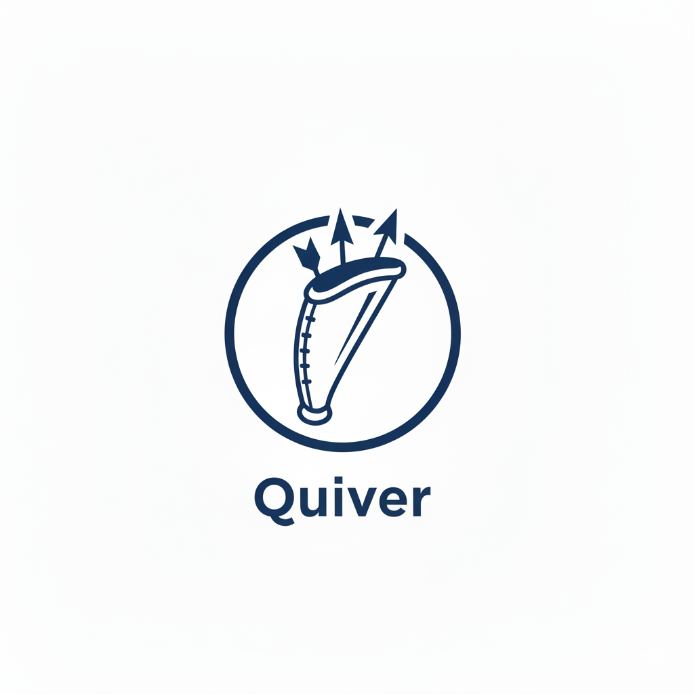

<p align="center">
  
</p>

# Quiver

Quiver is the aggregate Swift package for the Quiver protocol stack. It brings together the split `quiver-*` packages for QUIC, HTTP/3, WebTransport, authentication, framework adapters, and Media over QUIC behind one import surface.

> [!NOTE]
> This project is AI-generated and human-validated. The code was produced with the assistance of AI tooling and reviewed, tested, and validated by [Nassim Zen (@hironichu)](https://github.com/hironichu).

## What Is In The Stack

| Area | Package | Products |
| --- | --- | --- |
| QUIC | [`quiver-quic`](https://github.com/hironichu/quiver-quic) | `QUIC`, `QUICCore`, `QUICCrypto`, `QUICStream`, `QUICRecovery`, `QUICTransport`, `NIOUDPTransport`, `QUICConnection` |
| HTTP/3 and QPACK | [`quiver-http3`](https://github.com/hironichu/quiver-http3) | `HTTP3`, `QPACK` |
| WebTransport | [`quiver-webtransport`](https://github.com/hironichu/quiver-webtransport) | `WebTransport` |
| Authentication | [`quiver-auth`](https://github.com/hironichu/quiver-auth) | `QuiverAuth` |
| Framework adapters | [`quiver-adapters`](https://github.com/hironichu/quiver-adapters) | `QuiverVapor`, `QuiverHummingbird` |
| Media over QUIC | [`quiver-moq`](https://github.com/hironichu/quiver-moq) | `MOQCore`, `MOQRelay`, `MOQClient` |

The root package is intentionally small. Protocol implementation and package-specific documentation live in the dedicated repositories above.

## Requirements

- Swift 6.2 or newer
- macOS 15, iOS 18, tvOS 18, watchOS 11, visionOS 2, or Linux
- Windows 11 support through the documented Visual Studio and vcpkg setup

See [Docs/Windows.md](Docs/Windows.md) for Windows setup details.

## Installation

Add the aggregate package when you want one dependency that can expose the whole Quiver family:

```swift
dependencies: [
    .package(url: "https://github.com/hironichu/quiver.git", branch: "main")
]
```

Then depend on the aggregate product:

```swift
.target(
    name: "MyApp",
    dependencies: [
        .product(name: "Quiver", package: "quiver")
    ]
)
```

Use the dedicated `quiver-*` packages directly when you only need one layer, such as `quiver-quic` for QUIC-only work or `quiver-http3` for HTTP/3 and QPACK.

## Package Traits

The aggregate product uses SwiftPM package traits to conditionally re-export functionality:

| Trait | Enables |
| --- | --- |
| `QUICSupport` | QUIC products and core protocol modules |
| `QuiverRuntimeSupport` | Optional runtime-backed QUIC transport path, plus QUIC support |
| `HTTP3Support` | HTTP/3 and QPACK, plus QUIC support |
| `WebTransportSupport` | WebTransport APIs hosted by HTTP/3 |
| `AuthSupport` | Quiver HTTP/3 authentication helpers |
| `VaporSupport` | Vapor adapter APIs |
| `HummingbirdSupport` | Hummingbird adapter APIs |
| `MOQSupport` | Media over QUIC products |

The default trait set enables the complete stack. Build a narrower surface by selecting traits explicitly:

```bash
swift build --target Quiver --traits QUICSupport
swift build --target Quiver --traits QuiverRuntimeSupport
swift build --target Quiver --traits WebTransportSupport
```

## Local Development

During local development the root package looks for sibling package checkouts in `../quiver-packages` and uses them when present. If the local packages are not available, SwiftPM falls back to the GitHub URLs.

Override the local checkout location with:

```bash
export QUIVER_PACKAGES_PATH=/path/to/quiver-packages
```

Expected local layout:

```text
workspace/
├── quiver/
└── quiver-packages/
    ├── quiver-quic/
    ├── quiver-runtime/
    ├── quiver-http3/
    ├── quiver-webtransport/
    ├── quiver-auth/
    ├── quiver-adapters/
    └── quiver-moq/
```

## Documentation

| Document | Purpose |
| --- | --- |
| [Docs/Packages.md](Docs/Packages.md) | Package map, product list, traits, and dependency relationships |
| [Docs/Architecture.md](Docs/Architecture.md) | Stack architecture and ownership boundaries |
| [Docs/Usage.md](Docs/Usage.md) | Focused examples for QUIC, HTTP/3, WebTransport, auth, adapters, and MOQ |
| [Docs/Development.md](Docs/Development.md) | Local checkout layout, dependency fallback, mirrors, build, and test commands |
| [Docs/Windows.md](Docs/Windows.md) | Windows setup notes |
| [Docs/QuiverAuth.md](Docs/QuiverAuth.md) | Authentication and OIDC notes |
| [Docs/RFC9114-HTTP3.md](Docs/RFC9114-HTTP3.md) | HTTP/3 implementation notes |
| [RFC_COMPLIANCE.md](RFC_COMPLIANCE.md) | RFC compliance tracking |
| [Examples/EXAMPLES.md](Examples/EXAMPLES.md) | Example program guide |

## Quick Commands

```bash
swift build
swift test
swift build --target Quiver --traits QuiverRuntimeSupport
swift build --target Quiver --traits WebTransportSupport
```

Run package-specific builds from their dedicated repositories in `/home/hiro/quiver-packages` or from their GitHub checkouts.

## Credits

The QUIC transport layer was originally authored by [@1amageek](https://github.com/1amageek).

The HTTP/3, QPACK, WebTransport, authentication, adapters, Media over QUIC work, package split, integration tests, and documentation are maintained by [Nassim Zen (@hironichu)](https://github.com/hironichu).

## License

[MIT License](LICENSE)
